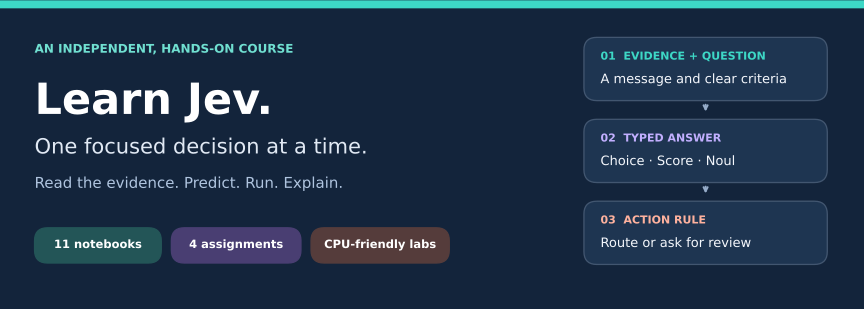
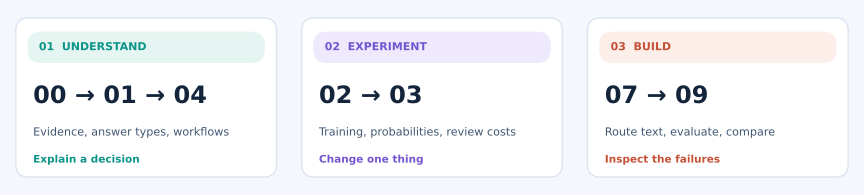

  <picture>
    <source media="(max-width: 650px)" srcset="assets/course-banner-mobile.svg">
    
  </picture>

# Jev learning course

  
  

Learn how **Jev from TypeSafe AI** turns evidence and a focused question into a typed answer.
Read saved examples, predict what will change, then run small experiments that make the ideas visible.

**[Start lesson 00 →](notebooks/00_start_here.ipynb)** · **[Visual guide](docs/VISUAL_GUIDE.md)** · **[Full curriculum](docs/COURSE.md)** · **[Practice](docs/PRACTICE.md)**

## Start in the way that suits you

| Read | Run in Colab | Run on your computer |
|---|---|---|
| [Open lesson 00](notebooks/00_start_here.ipynb). Saved explanations and figures are included. | [Launch lesson 00](https://colab.research.google.com/github/Optimizer077/jev-learning-course/blob/main/notebooks/00_start_here.ipynb), then choose **Runtime → Run all**. | [Follow the setup guide](docs/SETUP.md). CPU only; no model download or Jev key needed. |

> [!TIP]
> New to machine learning? Read **00 → 01 → 04**, then try [Assignment 1](assignments/01_design_a_decision.md). You can skip the code on your first pass.

## Choose your path

<picture>
  <source media="(max-width: 650px)" srcset="assets/learning-path-mobile.svg">
  
</picture>

| Your goal | Next step |
|---|---|
| **Understand** · evidence, answer types, and action rules | [Jev basics](notebooks/01_jev_basics.ipynb) → [Workflows](notebooks/04_workflows_and_related_models.ipynb) |
| **Experiment** · training, probabilities, and review costs | [Build from scratch](notebooks/02_decision_model_from_scratch.ipynb) → [Calibration](notebooks/03_calibration_and_decisions.ipynb) |
| **Build** · evaluate a local text-routing system | [Project](notebooks/07_text_routing_capstone.ipynb) → [Compare methods](notebooks/09_related_models_lab.ipynb) |

Each lesson has a **Colab button**, a goal, a worked example, and a self-check.
[Browse all eleven lessons](notebooks/README.md), including optional API and architecture labs.
Want hands-on neural training? [Lesson 10](notebooks/10_pytorch_models_lab.ipynb) trains **six small PyTorch models**
on a paired toy task, with saved curves, three seeds, and reloadable checkpoints. PyTorch is optional.

## Find what you need

| Folder | What's inside |
|---|---|
| [notebooks/](notebooks/README.md) | Eleven runnable lessons, saved results, and Colab links |
| [docs/](docs/README.md) | Curriculum, setup, glossary, references, and maintainer guides |
| [assignments/](assignments/README.md) | Four guided tasks with success criteria |
| [data/](data/README.md) | 54 fictional tickets and 864 synthetic sentences with fixed splits |

Teaching code lives in `src/`, rebuild tools in `scripts/`, and visual assets in `assets/`.
The optional offline playground is in `site/`; download the course and open `site/index.html` locally.
See [repository layout](docs/REPOSITORY.md) or [contributing](docs/CONTRIBUTING.md) for maintenance.

## Know what the examples establish

The NumPy and PyTorch models illustrate general mechanisms; they do not reproduce Jev's proprietary model.
The fictional dataset is a teaching example, not a production benchmark. Lesson 05 is the only
optional live integration and is **disabled by default**. [Sources and evidence labels](docs/SOURCES.md).

Independent educational course. Also learning about diffusion?
Explore [Language Diffusion Models — from scratch](https://github.com/Optimizer077/language-diffusion-models).
