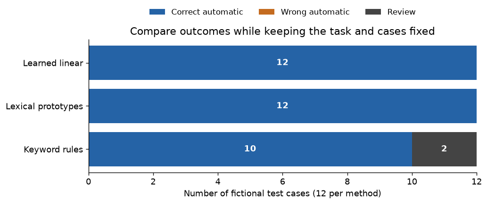

# Jev Learning Course

### Learn typed AI decisions through small, runnable experiments.

**10 notebooks · Self-paced · Beginner reading path · CPU-only local labs · Saved results included**

An independent course about Jev from TypeSafe AI and the ideas behind decision models. Start with
one support message, learn to read the output, then build and evaluate a small local system.

**[Start lesson 00](00_start_here.ipynb)** · **[Course outline](COURSE.md)** ·
**[Practice questions](PRACTICE.md)** · **[Quick reference](QUICK_REFERENCE.md)**

## Start here

1. Open **[00 · Start here](00_start_here.ipynb)** and read the saved examples directly on GitHub.
2. Continue with **[01 · Jev basics](01_jev_basics.ipynb)**, then **[04 · Workflows](04_workflows_and_related_models.ipynb)**.
3. Try **[Assignment 1](assignments/01_design_a_decision.md)** and explain your choices before checking the worked material.

You can complete this introduction without installing Python or creating an API account.
To change and run examples, download or clone the whole repository and follow **[SETUP.md](SETUP.md)**.
Use the Markdown guides and notebook links on GitHub; the optional HTML files are saved browser copies.

## What you will be able to do

- Choose between **Choice**, **Score**, and **Noul** for a precise question.
- Explain how evidence becomes scores, probabilities, and an application action.
- Distinguish output validity, accuracy, calibration, and authorization.
- Train a transparent text classifier and evaluate it on separate data.
- Compare rules, lexical similarity, and learned classification while inspecting their failures.

The beginner path assumes no machine-learning background. Running the coding paths is easier
with basic Python: variables, lists, dictionaries, functions, and arrays. Each notebook states its
prerequisites, explains the idea before the code, and ends with a self-check.

## Choose a learning track

| Track | Follow this order | Finish with |
|---|---|---|
| **Understand** · no coding required | 00 → 01 → 04 | [Design a decision](assignments/01_design_a_decision.md) |
| **Build** · basic Python | 00 → 01 → 02 → 03 → 07 | [Inspect a routing system](assignments/03_evaluate_a_router.md) |
| **Explore** · optional deeper work | 02 → 06 → 09 | Explain a representation failure |
| **Integrate** · optional real API | 01 → 04 → 05 | Write an evaluation plan before enabling live calls |

Use [the course outline](COURSE.md) for learning outcomes and checkpoints, or
[the three-session plan](LEARNING_GUIDE.md) for a study schedule. You do not need to finish every
lesson. Each notebook runs independently.

## Curriculum

| Lesson | What you learn | Level |
|---|---|---|
| [00 · Start here](00_start_here.ipynb) | The running example, evidence labels, and how to study | Start here |
| [01 · Jev basics](01_jev_basics.ipynb) | State, Choice, Score, Noul, and valid-but-wrong answers | Beginner |
| [02 · A model from scratch](02_decision_model_from_scratch.ipynb) | Features, weights, softmax, training, and visible decision boundaries | Coding |
| [03 · Calibration and decisions](03_calibration_and_decisions.ipynb) | Outcome frequencies, review thresholds, and action costs | Applied probability |
| [04 · Workflows and related models](04_workflows_and_related_models.ipynb) | Focused judgments, dependencies, permissions, and ordinary code | Beginner → builder |
| [05 · Optional real API](05_optional_real_jev_api.ipynb) | Request structure, response checks, and an optional live call | Optional integration |
| [06 · Architecture and training lab](06_architecture_and_training_lab.ipynb) | Generic candidate scoring, attention masks, and training objectives | Optional advanced |
| [07 · Text-routing project](07_text_routing_capstone.ipynb) | Train, calibrate, route, evaluate, and inspect failures | Project |
| [08 · Exercises and solutions](08_exercises_and_solutions.ipynb) | Worked reasoning and executable checks | Practice |
| [09 · Related-models lab](09_related_models_lab.ipynb) | Rules, lexical prototypes, and a learned classifier on fixed cases | Optional comparison |

## Learn by predicting

Use this rhythm: **read → predict → run or inspect → explain**.

Before changing a number, write what you expect. Afterward, explain the result and name one
limitation. A successful run is useful; being able to explain a change is the stronger check.

- [12 practice questions with fold-open explanations](PRACTICE.md)
- [Three assignments and their success criteria](assignments/README.md)
- [Worked notebook exercises](08_exercises_and_solutions.ipynb)
- [Quick reference: calculations and common confusions](QUICK_REFERENCE.md)
- [Model guide: how related approaches fit together](MODEL_GUIDE.md)

See one experiment from the course

This is an authored teaching dataset. The word-order experiment in lesson 09 then exposes a shared
failure, so the small perfect score does not establish broad reliability.

## Run locally

Follow **[SETUP.md](SETUP.md)** for Windows, macOS, or Linux. Keep the repository files together;
the notebooks use the helper Python files and included data.

The local labs require no GPU, model download, or Jev key. Lesson 05 is the only optional live
integration, disabled by default. Saved outputs let you read before installing anything.
Use **Restart Kernel and Run All** for a clean experiment.

## Evidence and sources

This course labels documented Jev behavior, general machine-learning mechanisms, and invented
teaching examples. The NumPy models explain ideas; they do not reproduce Jev's proprietary model.
The 54 fictional tickets are deliberately small and are not a production benchmark.

Provider documentation was checked on **2026-10-01**. [SOURCES.md](SOURCES.md) links the primary
references, and [data/README.md](data/README.md) explains the dataset and fixed splits.
Consult current provider documentation before live use.

## Help and contributions

Found a confusing explanation or a broken cell? Use the repository's issue templates and identify
the lesson, the step, and the result you expected. Suggestions that make a lesson easier to learn
are welcome. See **[CONTRIBUTING.md](CONTRIBUTING.md)** before proposing a change.

| For learners | For maintainers |
|---|---|
| [Setup and troubleshooting](SETUP.md) | [Contribution guide](CONTRIBUTING.md) |
| [Frequently asked questions](FAQ.md) | [Rebuild and package](SHARING.md) |
| [Plain-language glossary](GLOSSARY.md) | [Repository layout](REPOSITORY.md) |
| [Study plan](LEARNING_GUIDE.md) | [GitHub publishing guide](GITHUB_PUBLISHING.md) |

Independent educational resource; not an official TypeSafe course.
