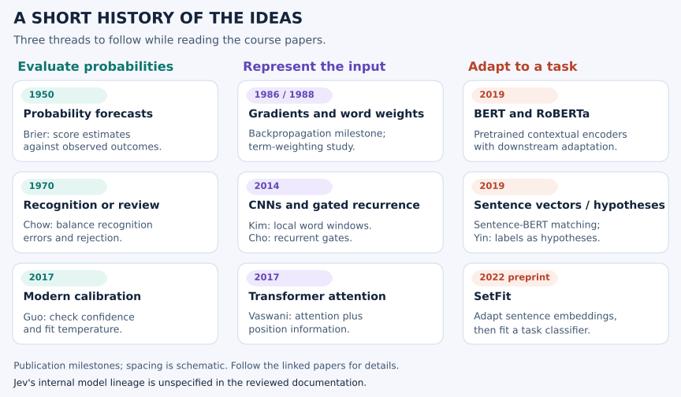

# A short history, and four nearby research directions

[Course home](../README.md) · [Notebook catalog](../notebooks/README.md) · [Related-methods notebook](../notebooks/09_related_models_lab.ipynb) · [Paper guide](PAPER_GUIDE.md)

Start with three questions: **how is text represented, how do labels enter, and how should the
result be evaluated?** The papers below developed different answers to these questions.
Read one method at a time, then compare it with the small models you already ran.

This is a history of selected published methods relevant to the course. It is not a documented
Jev ancestry. TypeSafe's [announcement](https://typesafe.ai/blog/introducing-system-one-models-and-jev)
and [System One definition](https://docs.typesafe.ai/concepts/system-one) are the sources for Jev's
product description; the papers here do not disclose its private architecture or RLCD recipe.

## Follow three threads

<picture>
  <source media="(max-width: 650px)" srcset="../assets/model-history-mobile.svg">
  
</picture>

The dates below identify particular publications. Backpropagation, term weighting, and attention
have earlier histories; these papers should not be treated as their first invention dates.

| Publication | What to learn from it | Course connection |
|---|---|---|
| **1950 · [Brier](https://doi.org/10.1175/1520-0493(1950)078%3C0001:VOFEIT%3E2.0.CO;2)** | Evaluate probability forecasts against outcomes | Binary and multiclass scores in 03 and 07 |
| **1970 · [Chow](https://doi.org/10.1109/TIT.1970.1054406)** | Balance recognition errors against rejection | Review costs and automation coverage |
| **1979 · [Efron](https://doi.org/10.1214/aos/1176344552)** | Resample observed cases to study sampling variation | The bootstrap interval in 03 |
| **1986 · [Rumelhart, Hinton, and Williams](https://doi.org/10.1038/323533a0)** | Propagate derivatives to learn layered representations | Weight updates in 02 and 10 |
| **1988 · [Salton and Buckley](https://doi.org/10.1016/0306-4573(88)90021-0)** | Study useful word-weighting choices for retrieval | The lexical matching baseline in 09 |
| **2007 · [Gneiting and Raftery](https://doi.org/10.1198/016214506000001437)** | Proper scores reward honest distributions in expectation | Why log loss and Brier care about probabilities |
| **2014 · [Kim](https://aclanthology.org/D14-1181/) and [Cho et al.](https://aclanthology.org/D14-1179/)** | Learn local sentence features or gated recurrent state | The tiny CNN and GRU in 10; implementation differences are stated |
| **2015 · [Kingma and Ba](https://arxiv.org/abs/1412.6980)** | Adapt updates with bias-corrected gradient moments | Adam in 10; the initial preprint is from 2014 |
| **2017 · [Vaswani et al.](https://arxiv.org/abs/1706.03762) and [Guo et al.](https://proceedings.mlr.press/v70/guo17a.html)** | Transformer attention; separately, modern calibration and temperature scaling | Architecture in 06/10 and probability evaluation in 03/07 |
| **2019 · [BERT](https://aclanthology.org/N19-1423/) and [RoBERTa](https://arxiv.org/abs/1907.11692)** | Pretrain contextual encoders and adapt them to downstream tasks | Background for representations richer than word presence; BERT's row uses its 2019 conference publication |
| **2019 · [Sentence-BERT](https://aclanthology.org/D19-1410/) and [Yin, Hay, and Roth](https://aclanthology.org/D19-1404/)** | Train sentence vectors for matching; or express labels as hypotheses | Two ways to connect text with descriptions |
| **2022 preprint · [SetFit](https://arxiv.org/abs/2209.11055)** | Adapt a pretrained sentence encoder and classifier from a small labeled task set | Few-shot supervised adaptation; different from the randomly initialized toy models |

## Four papers to read more closely

### RoBERTa · improve the pretraining recipe

[Liu et al. (2019), *RoBERTa: A Robustly Optimized BERT Pretraining Approach*](https://arxiv.org/abs/1907.11692)
studies BERT's training choices. It uses more data and longer training, larger batches, dynamic
masking, and removes the next-sentence-prediction objective. It retains an encoder-based approach.
The lesson is that training data and procedure matter alongside architecture.

For a bounded classification task, a contextual encoder can be adapted with an output head.
Our tiny Transformer shares the attention idea, but does not reproduce RoBERTa's pretraining,
tokenization, scale, weights, or results. This course does not execute RoBERTa.

### Sentence-BERT · represent sentences for comparison

[Reimers and Gurevych (2019), *Sentence-BERT: Sentence Embeddings using Siamese BERT-Networks*](https://aclanthology.org/D19-1410/)
starts from pretrained contextual encoders and trains shared-weight sentence representations
using paired or triplet objectives. The paper describes pooling choices; its default uses mean
pooling of contextual token outputs. Sentence vectors can then be compared with cosine similarity.

Mean pooling does not itself make our random-embedding baseline Sentence-BERT. In the baseline,
each word has the same vector regardless of its neighbors. In a contextual encoder, token outputs
already depend on the sequence before averaging. A contextual average can therefore retain
order-dependent information. Its existence does not establish that a specific model solves our
reversed-message example. A similarity score is also not a calibrated class probability.

### Entailment classification · make the label a hypothesis

[Yin, Hay, and Roth (2019), *Benchmarking Zero-shot Text Classification: Datasets, Evaluation and Entailment Approach*](https://aclanthology.org/D19-1404/)
recasts candidate labels as natural-language hypotheses. The input text is the premise; a
source-trained model judges whether it supports the hypothesis. This task is called **natural
language inference (NLI)**. A target label can
therefore enter as a description rather than only as a column of a fixed classifier head.

The reviewed paper trains binary entailment/non-entailment models using source datasets such
as MNLI, RTE, and FEVER. Do not silently substitute a modern three-class pipeline or a particular
softmax-over-candidates convention and attribute it to that paper. Its zero-shot setting does
not mean the underlying model has never been trained. Hypothesis wording, candidate definitions,
and evaluation labels all matter.

The paper separates **fully-unseen** target labels, using the source-trained inference model,
from **partially-unseen** labels, where provided examples from seen task labels allow additional
fine-tuning. Read the evaluation setting alongside each result.

This is a useful comparison with evidence-plus-question workflows. It does not establish that
Jev uses NLI, or that entailment scores implement Choice, Score, Noul, or Jev confidence.

### SetFit · learn a small labeled task

[Tunstall et al. (2022), *Efficient Few-Shot Learning Without Prompts*](https://arxiv.org/abs/2209.11055)
introduces SetFit. First, positive and negative pairs from labeled examples adapt a pretrained
Sentence Transformer through contrastive fine-tuning. Second, a logistic-regression head learns
the task labels from the encoded original examples. Prediction encodes a new text and applies
that learned classifier.

Here, contrastive fine-tuning teaches the encoder to give same-label pairs higher similarity
and different-label pairs lower similarity. It learns how to compare examples before learning
the final task classifier.

The pair construction reuses existing labels; it does not create new independent evidence or
an enlarged independent test set. The original paper's second stage is logistic regression;
later library options are separate implementation choices. Our six toy models train from random
weights and do not reproduce this pretrained two-stage method.

## Compare how labels enter

These are mechanism comparisons. Only the NumPy and six small PyTorch models are executed in
the course; no accuracy ranking against the methods below has been measured.

| Method | How labels enter | Task-specific fitting? | Meaning of output | What to inspect |
|---|---|---|---|---|
| Learned classifier / encoder head | Learned output classes | Yes for the task head, often the encoder too | Class output, possibly normalized probabilities | New-label handling, errors, calibration |
| Sentence-BERT matching | Candidate descriptions or example vectors | Encoder was trained previously; task adaptation may be added | Similarity | Wording, negation, score interpretation |
| Entailment-based classification | Text plus label hypotheses | Source inference training; no task fitting in the fully-unseen setup | Entailment-based judgments | Templates, candidate definitions, threshold policy |
| SetFit | Labeled examples define the task classes | Yes, through the two stages | Learned classifier output | Label quality, split integrity, held-out behavior |
| Jev's documented interface | State, typed questions, and criteria in the request | No learner-side fitting in this course | Documented typed estimates | Contract, measured correctness, calibration, application policy |

The nearest analogy depends on the question. A task head illustrates direct classification;
sentence vectors illustrate representation and matching; NLI illustrates judging a description;
SetFit illustrates adaptation from examples. None establishes Jev's model lineage.

## A reading exercise

Use “The payment failed, not the export” and its reversed partner. For one paper, write:

1. What is supplied as evidence, and how are the candidate labels represented?
2. What parameters were trained previously, and what would need new task examples?
3. What information survives the representation before the final score?
4. Does the output mean similarity, entailment, or a task-class probability?
5. What new held-out examples would test your claim about the pair?

Do not fill in an unexecuted model's predictions as facts. Record the source's method, our smaller
implementation's differences, and the measurement needed to compare them. Source access and
full-text limits are recorded in [SOURCES.md](SOURCES.md).
