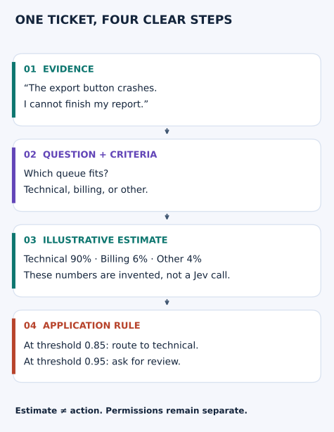
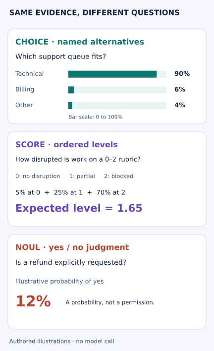
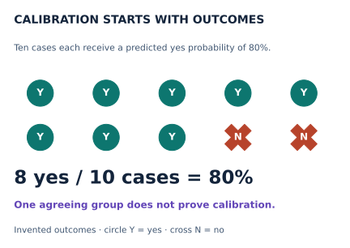
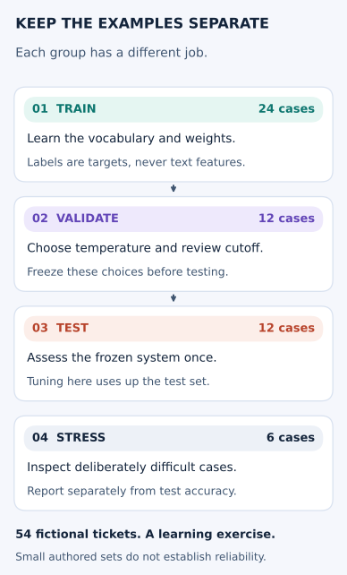
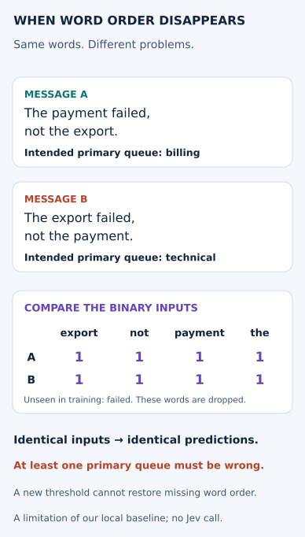

# See the idea before the code

[Course home](../README.md) · [Start lesson 00](../notebooks/00_start_here.ipynb) · [Quick reference](QUICK_REFERENCE.md)

These diagrams use invented examples. They describe the decision interface and application rules;
they do not show Jev's proprietary architecture or measure its accuracy.

| You want to understand… | Start here |
|---|---|
| What goes into a decision | [Follow one ticket](#follow-one-ticket) |
| Which answer type fits | [Ask three different questions](#ask-three-different-questions) |
| What a probability means | [Compare predictions with outcomes](#compare-predictions-with-outcomes) |
| How to evaluate a small project | [Keep the data splits separate](#keep-fitting-tuning-and-testing-separate) |
| Why words alone can fail | [See what word order changes](#see-what-word-order-changes) |

## Follow one ticket

Give the message as **evidence**, then ask a **question** with clear **criteria**:
technical means broken product behavior, billing means charges or invoices, and other means
neither listed queue fits or the evidence is insufficient.

Changing the threshold changes the action, while the estimate stays the same.
The thresholds are teaching choices, not recommendations for a real support system.
Permissions remain separate: a refund prediction cannot authorize a payment.

**Predict:** at threshold 0.92, what happens? Then explain why.

Check your answer

The case goes to review because 0.90 is below 0.92. Technical remains the most likely queue.

Continue with [lesson 01](../notebooks/01_jev_basics.ipynb).

## Ask three different questions

The same message can support several judgments. Choose the answer type to match the question.

- **Choice:** which named alternative fits? Here, technical is most likely.
- **Score:** where is the expected position on an ordered rubric? Here, 1.65 differs from the most likely level, 2.
- **Noul:** how likely is the positive answer? Here, 12% is an estimate of an explicit refund request.

The numbers are authored illustrations, not three outputs from a real Jev call.
[Choice reference](https://docs.typesafe.ai/primitives/choice) ·
[Score reference](https://docs.typesafe.ai/primitives/score) ·
[Noul reference](https://docs.typesafe.ai/primitives/noul).

**Predict:** which answer type fits “Was a refund explicitly requested?” Which fits
“Which support queue fits?” Use “Can you refund yesterday's duplicate charge?” as the evidence.

Check your answer

The refund-request question uses Noul because it asks for a yes/no judgment. The queue
question uses Choice because it compares named alternatives. The message is evidence for both;
it is not itself the question definition.

## Compare predictions with outcomes

An 80% estimate does not make any one outcome certain. Calibration concerns patterns across
many predictions and their observed outcomes.

**Predict:** change one yes to no. The observed frequency becomes 70% while the predictions stay 80%.
One finite group can fluctuate; evaluate many groups and their sample sizes before judging calibration.
Continue with [lesson 03](../notebooks/03_calibration_and_decisions.ipynb).

## Keep fitting, tuning, and testing separate

The project uses **billing, technical, and account** as its three queue options. These differ
from the opening illustration's options because we are asking a different question.
The six stress examples include an out-of-domain `other` case; `other` is not a trained class.

The counts come from [tickets.json](../data/tickets.json), not a measured Jev evaluation.
Stress cases were chosen to expose weaknesses; combining them with test cases would change the
meaning of the reported test result.

**Predict:** you see a test mistake and adjust the cutoff to fix it. Can the same test set still
give an untouched assessment of that new policy?

Check your answer

No. You used its result to choose a setting. Record that change and assess the new frozen
policy on fresh held-out examples. Do not move a difficult row out of test just to improve the score.

Continue with [lesson 07](../notebooks/07_text_routing_capstone.ipynb).

## See what word order changes

Both messages contain the same words. In one, payment failed; in the other, export failed.
Our binary representation records which known words appear, losing their order and repetition.

The actual training vocabulary includes `export`, `not`, `payment`, and `the`; it does not include
`failed`. All other feature columns are zero for this pair. Dropping `failed` is one limitation;
adding it would still leave these two word-presence vectors identical.

**Predict:** could a different confidence threshold route A to billing and B to technical
when their probability vectors are identical?

Check your answer

No. The same deterministic threshold rule sees the same probabilities. It must make the
same decision for both. Review can avoid an automatic mistake, but it does not recover the
missing meaning. To distinguish them automatically, preserve information such as word order
and evaluate the changed system on held-out cases.

This demonstrates a limitation of the local baseline. It does not measure Jev or prove that
any particular replacement handles every negation. Compare the local methods in
[lesson 09](../notebooks/09_related_models_lab.ipynb).

## Know when you understand

You can separate the evidence, the question, the estimated answer, and the action.
You can explain why changing an application rule does not change a model's estimate.
You can name one result these illustrations do **not** establish.
If you take the project path, you can explain why its data splits and its input representation matter.

[Try the practice questions](PRACTICE.md) · [Choose your learning path](COURSE.md)
